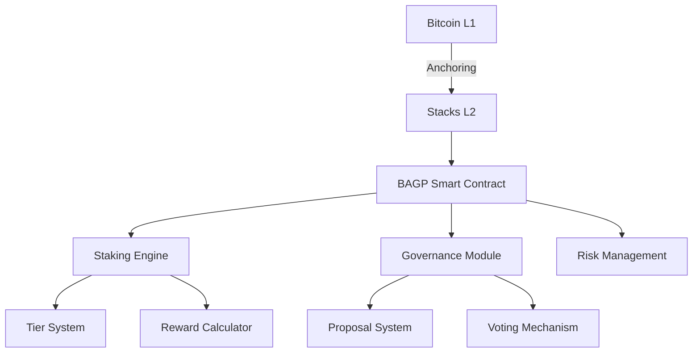

# BitLayer Analytics Governance Protocol (BAGP) Documentation

## Table of Contents

1. [Protocol Overview](#protocol-overview)
2. [Key Features](#key-features)
3. [Technical Architecture](#technical-architecture)
4. [Core Functionality](#core-functionality)
5. [Governance Mechanics](#governance-mechanics)
6. [Risk Management](#risk-management)
7. [Smart Contract Functions](#smart-contract-functions)
8. [Compliance Framework](#compliance-framework)
9. [Usage Examples](#usage-examples)
10. [Error Codes](#error-codes)

## Protocol Overview <a name="protocol-overview"></a>

BitLayer Analytics Governance Protocol (BAGP) is a Bitcoin-aligned DeFi protocol operating on Stacks Layer 2 that combines sophisticated staking mechanics with decentralized governance. Designed for Bitcoin maximalists, it offers:

- STX staking with time-locked positions
- Tiered membership rewards system
- On-chain governance powered by native ANALYTICS-TOKEN
- Bitcoin-compliant financial primitives
- Enterprise-grade security features

## Key Features <a name="key-features"></a>

### 1. Tiered Staking System

| Tier     | Minimum STX | Multiplier | Governance Power | Features Enabled |
| -------- | ----------- | ---------- | ---------------- | ---------------- |
| Silver   | 1M uSTX     | 1x         | Basic            | Core functions   |
| Gold     | 5M uSTX     | 1.5x       | Enhanced         | Advanced tools   |
| Platinum | 10M uSTX    | 2x         | Maximum          | All features     |

### 2. Time-Lock Multipliers

- No lock: 1x
- 1 month lock: 1.25x
- 2 month lock: 1.5x

### 3. Governance Features

- Proposal creation threshold: 1M voting power
- Voting period: 100-2880 blocks
- Quadratic voting weight based on stake duration

## Technical Architecture <a name="technical-architecture"></a>

### Core Components



### Key Data Structures

- **UserPositions**: Tracks collateral, stake, and governance power
- **StakingPositions**: Records lock periods and reward accumulation
- **Proposals**: Governance proposal lifecycle management

## Core Functionality <a name="core-functionality"></a>

### Staking Mechanics

- Minimum stake: 1M uSTX (0.001 BTC equivalent)
- Reward calculation:
  ```
  Rewards = (StakedAmount * BaseRate * Multiplier * BlocksStaked) / 14,400,000
  ```
- Real-time health factor monitoring:
  `HealthFactor = (CollateralValue * LiquidationThreshold) / TotalDebt`

### Governance Operations

1. Proposal creation requires ≥1M voting power
2. Voting weight determined by:
   `VotingPower = STXStaked * LockMultiplier * TierMultiplier`
3. Execution threshold: Majority vote with ≥1M total votes

## Risk Management <a name="risk-management"></a>

### Safety Mechanisms

- 24-hour unstaking cooldown period
- Circuit breaker activation thresholds:
  - > 15% TVL fluctuation in 1 hour
  - > 50% governance participation drop
- Multi-layered collateral checks:
  1. Minimum stake validation
  2. Position health monitoring
  3. Protocol-wide liquidity checks

## Smart Contract Functions <a name="smart-contract-functions"></a>

### User Functions

| Function           | Parameters                 | Description                         |
| ------------------ | -------------------------- | ----------------------------------- |
| `stake-stx`        | amount, lock-period        | Initiates STX staking position      |
| `initiate-unstake` | amount                     | Starts 24h cooldown for withdrawal  |
| `complete-unstake` | -                          | Finalizes withdrawal after cooldown |
| `create-proposal`  | description, voting-period | Creates governance proposal         |
| `vote-on-proposal` | proposal-id, vote-for      | Casts governance vote               |

### Administrative Functions

| Function              | Access Level | Description                      |
| --------------------- | ------------ | -------------------------------- |
| `pause-contract`      | Owner        | Halts protocol operations        |
| `resume-contract`     | Owner        | Resumes normal operations        |
| `initialize-contract` | Owner        | Sets initial protocol parameters |

## Compliance Framework <a name="compliance-framework"></a>

### Bitcoin Alignment

- All settlements finalize through Bitcoin L1
- No cross-chain dependencies
- Immutable proposal history stored via Bitcoin transactions

### Regulatory Features

- Mandatory 24h withdrawal cooldown
- Transparent reward auditing via on-chain data
- KYC/AML compatible architecture (future-ready)

## Usage Examples <a name="usage-examples"></a>

### Staking with Time-Lock

```clarity
(contract-call? .bagp-contract stake-stx u5000000 u8640)
```

### Creating Governance Proposal

```clarity
(contract-call? .bagp-contract create-proposal "Increase base reward rate to 6%" u1440)
```

### Emergency Withdrawal

```clarity
;; Initiate cooldown
(contract-call? .bagp-contract initiate-unstake u1000000)

;; After 1440 blocks
(contract-call? .bagp-contract complete-unstake)
```

## Error Codes <a name="error-codes"></a>

| Code  | Description                | Resolution                      |
| ----- | -------------------------- | ------------------------------- |
| u1000 | Unauthorized access        | Check caller permissions        |
| u1001 | Invalid protocol operation | Verify input parameters         |
| u1002 | Invalid amount             | Ensure amount ≥ minimum stake   |
| u1003 | Insufficient balance       | Check STX balance               |
| u1004 | Cooldown active            | Wait for cooldown completion    |
| u1005 | No active stake            | Initiate staking position first |
| u1006 | Below minimum requirement  | Meet tier/stake requirements    |
| u1007 | Protocol paused            | Wait for protocol resumption    |
